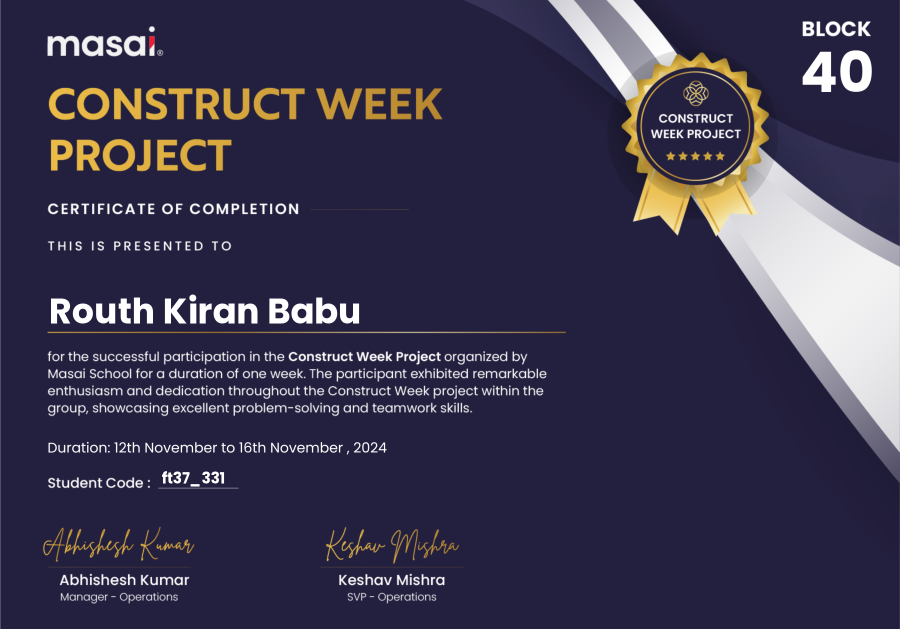

# Ending Certificate
 </img>

# 👉 Given
## Links
| Type | Document |
| --- | --- |
| `Cypress` | https://www.cypress.io/ |
| `Reddit` | https://www.reddit.com/ |
| `Submission` | https://masai-school.notion.site/CW-B40-Daily-Submissions-138aadbf4a8d814ea7bcf0474c880ffe |

> [!NOTE]
> [*Ctrl + Click on link*] 👉 opens in new tab😊

# 👉Working Days and Tasks
| Day Number | Tasks | Branch Link |
| :---: | :--- | ---: |
| `1` | Cypress Setup, [Learning Readme editing.](https://docs.github.com/en/get-started/writing-on-github/getting-started-with-writing-and-formatting-on-github/quickstart-for-writing-on-github#introduction), [Learning Git Commands.](https://github.com/RouthKiranBabu/Reddit-API-Testing/tree/day_4?tab=readme-ov-file#git-commands) | [Day 1](https://github.com/RouthKiranBabu/testReddit/tree/day_1) |
| `2` | [Cypress Code](https://github.com/RouthKiranBabu/CWP_B39/tree/day_2/Cypress/cypress/e2e), [Learning Readme editing.](https://docs.github.com/en/get-started/writing-on-github/getting-started-with-writing-and-formatting-on-github/quickstart-for-writing-on-github#introduction), Learning Git Commands. | [Day 2](https://github.com/RouthKiranBabu/testReddit/tree/day_2) |
| `3` | Cypress Code Modification, Postman API testing and Code Adding. | [Day 3](https://github.com/RouthKiranBabu/testReddit/tree/day_3) |
| `4` | Making a project Simpler, Readme Editing. | [Day 4](https://github.com/RouthKiranBabu/testReddit/tree/day_4) |
