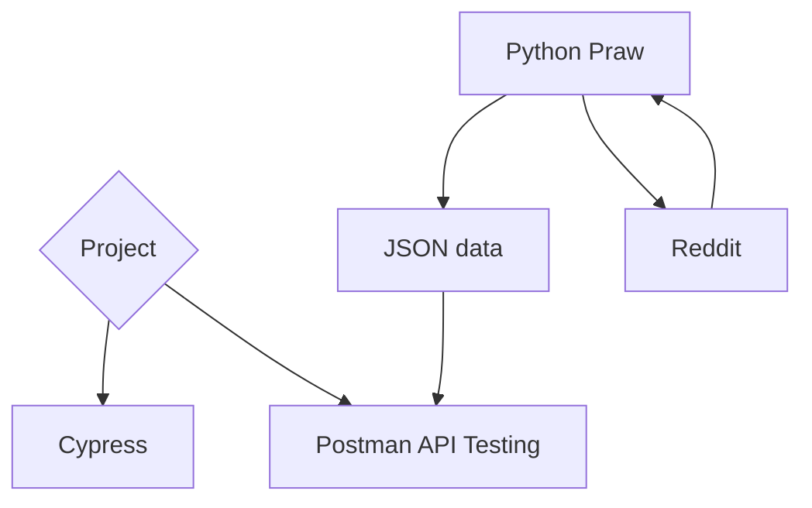

# Cypress Automation and Postman API testing

## Introduction
### Cypress
Cypress is a powerful, modern front-end testing tool built specifically for web applications. It allows developers and testers to write automated tests to ensure the functionality, reliability, and performance of web apps. What sets Cypress apart from other testing frameworks is its ability to work directly with the browser, providing a fast, reliable, and easy-to-use testing environment.
### Postman API Testing
Postman is a powerful API testing tool that simplifies the process of developing, testing, and debugging APIs. It provides an intuitive user interface for creating and sending HTTP requests, inspecting responses, and automating API workflows.

## Things Received
  - [Constructive Week Project](https://masai-school.notion.site/MSI-CW-Block-40-0fb207f269b14fb084887da3bd8709f8)

## Code Links
  - Cypress [Documentation](https://docs.cypress.io/app/get-started/why-cypress): [Project Folder](https://github.com/RouthKiranBabu/testReddit/tree/day_4/CypressAutomation)
  - Postman [Documentation](https://learning.postman.com/docs/introduction/overview/): [Project Folder](https://github.com/RouthKiranBabu/testReddit/tree/day_4/Postman)
  - Python Praw [Documentation](https://praw.readthedocs.io/en/stable/): [Project Folder](https://github.com/RouthKiranBabu/testReddit/tree/day_4/PrawPython)

## Directory Structure


## Video Walkthrough of the project and codebase
 </img>

## Features
### Key Features of Cypress
- `Real-time Reloads`: Automatically reloads tests on changes, offering instant feedback.
- `Automatic Waiting`: It waits for DOM elements to load, eliminating the need for manual wait commands.
- `Time Travel`: You can visually see each step of the test execution with a snapshot for easy debugging.
- `Built-in Assertions`: Provides built-in assertions that validate the behavior of your application during the test run.
- `Headless Browser Testing`: Supports running tests without a graphical interface using headless browsers.
- `Easy Setup`: Cypress doesn’t require complex setup or additional configurations. You just install the tool and can start writing tests.
Cypress is typically used for end-to-end testing, but it also supports integration and unit testing. It is particularly popular for testing JavaScript-based applications, but it works well with other tech stacks too.
#### Advantages and Disadvantages of Cypress
| Advantages | Disadvantages |
| :--- | :--- |
| `Fast and Reliable Testing`: Executes tests directly in the browser, offering quick feedback. |	`Limited Browser Support`: Only supports Chromium-based browsers (e.g., Chrome, Edge) and Firefox. |
| `Developer-Friendly`: Provides an intuitive syntax and debugging tools. |	`No Native Multi-Tab Support`: Testing across multiple tabs is complex. |
| `Automatic Waiting`: Automatically waits for DOM elements to load and XHR requests to finish, reducing the need for explicit waits. |	Not Ideal for Unit Testing: Designed primarily for end-to-end (E2E) testing. |
| `Real-Time Reloads`: Instantly reloads the browser when test files are updated. |	`Single Language`: Requires knowledge of JavaScript, limiting its use for teams using other languages. |
| `Comprehensive Test Runner`: Offers a built-in dashboard for debugging and managing tests. |	`Resource-Intensive`: Can be heavy on CPU and memory for large test suites. |
| `Built-In Assertions`: Comes with powerful, built-in assertions for testing. |	`No Cross-Browser Execution`: Doesn’t natively support testing on Safari or Internet Explorer. |
| `Rich Ecosystem`: Supports plugins and integration with CI/CD tools for advanced workflows. |	`Limited Support for Mobile Testing`: Cannot run directly on mobile devices or simulators. |
| `Time Travel Feature`: Takes snapshots during test execution, enabling detailed inspection of each step. |	`Steeper Learning Curve for Beginners`: Though developer-friendly, newcomers might take time to grasp advanced features. |
| `Easy Mocking`: Simplifies mocking of server responses and network requests. |	`License Costs for Advanced Features`: The Cypress Dashboard Service has premium features that are not free. |
| `Active Community`: Strong support and frequent updates from the Cypress team and community. |	`Requires Node.js`: Necessitates installing Node.js, which may add complexity for non-JavaScript teams. |

### Key Features of Postman
  - `User-Friendly Interface`: Allows users to easily construct and send HTTP requests (GET, POST, PUT, DELETE, etc.).
  - `Request Customization`: Supports adding headers, query parameters, authorization, and body data (JSON, XML, etc.).
  - `Response Validation`: Displays server responses, including status codes, headers, and body, for debugging and validation.
  - `Automation with Collections`: Group related API requests into Collections for reusability and sharing.
  - `Environment Management`: Define variables and environments for dynamic testing (e.g., development, staging, production).
  - `Scripting`: Use JavaScript for pre-request scripts and test scripts to add logic for request execution and response validation.
  - `Integration`: Supports integrations with CI/CD pipelines, version control systems, and other tools like Newman for command-line execution.
  - `Collaboration`: Enables teams to collaborate on API testing and documentation in real-time.
#### Advantages and Disadvantages of using Postman
| Advantages | Disadvantages |
| :--- | :--- |
| `User-Friendly Interface`: Easy to use, even for beginners. |	`Heavy Resource Usage`: Can consume significant system resources. |
| `Supports Multiple HTTP Methods`: GET, POST, PUT, DELETE, etc., for comprehensive testing. |	`Limited Collaboration in Free Tier`: Advanced collaboration requires a paid plan. |
| `Environment Variables`: Enables dynamic testing for multiple environments (e.g., dev, prod). |	`No Full IDE Integration`: Lacks direct integration with development environments. |
| `Automation`: Collections and Newman CLI enable automated API testing. |	`Limited for Complex Workflows`: Handling intricate test flows can be challenging. |
| `Scriptable Testing`: Pre-request and test scripts use JavaScript for advanced functionality. |	`Learning Curve for Scripting`: Requires knowledge of JavaScript for complex test cases. |
| `Extensive Community and Documentation`: Offers robust support and learning resources. |	`Limited Load Testing`: Not designed for high-volume performance or stress testing. |
| `Cross-Platform`: Available on Windows, macOS, and Linux. |	`Cloud Dependency`: Some features rely on Postman’s cloud, raising privacy concerns. |
| `Built-in Response Validation`: Helps debug and validate API responses quickly. |	`Version Control`: Lacks built-in integration with Git; manual work is required. |
| `Free Tier Availability`: Basic functionality is free, suitable for small teams. |	`Customization Limitations`: Limited ability to customize the UI or workflow. |
| `Supports Multiple Formats`: Works with JSON, XML, HTML, and raw data. |	`Not Specialized for Backend Testing`: May not replace dedicated backend testing frameworks. |

## Design Decisions or Assumptions
  1. Made different folders for each Sections:
     - `Cypress` - For Automation testing.
     - `Praw Module in Python` - To get JSON data.
     - `Postman API Testing` - For requests and response communication using JSON file.

## Installation & Getting started
  - [Cypress](https://www.cypress.io/)
  - [VS Code](https://code.visualstudio.com/)
  - [Postman](https://www.postman.com/downloads/)

### Commands
#### To install JSON Server
```bash
npm install -g json-server
```
#### To run JSON Server
```bash
json-server jsonFile
```
#### Git Commands
```bash
1. How to connect the folder to the GitHub repository.
cd EnterWorkingDirectory
git init
git add .
git commit -m "first commit"
git remote add origin https://github.com/RouthKiranBabu/testrepo.git
https://github.com/RouthKiranBabu/testReddit.git
git branch
git branch day_1
git checkout day_1
git push -u origin day_1
git push -u origin master
git pull --rebase origin master
git commit -m "First Commit"
git push -u origin master
git status
git reflog
// refresh the page

cd "Project folder path"
git status

// to check what branch we are in
git branch

// to create a new branch
git branch branchName

// to check all the branch
git branch

// to move to the desired branch
git checkout branchName
git branch

// to create a file
touch login.java
git status

git add .
git status
git commit -m "branch demo"
git status
git push -u origin login

// moving to the other branch also changes files and folders
git checkout main

git status

// when you are in the main branch to merge
// then whatever files and folder is present in the 
git merge login

git push -u origin main
git branch -d login

// to delete the branch
git push origin --delete login

Eg:
cd OneDrive
cd Desktop
cd projectFolder
git status
git add .
git commit -m "added Initial cypress look."
git push -u origin day_1

Eg:
cd OneDrive
cd Desktop
cd projectFolder
git branch day_2
git checkout day_2
git status
git add .
git status
git commit -m "added Second days work."
git push -u origin day_2

```

## Credentials
Provide user credentials for autheticated pages

## APIs Used
API made by json-server.

## API Endpoints
 - `Get`: http://localhost:3000/contents
 - `Post`: http://localhost:3000/contents
 - `Update`: http://localhost:3000/contents/5
 - `Patch`: http://localhost:3000/contents/5
 - `Delete`: http://localhost:3000/contents/5

## Technology Stack
List and provide a brief overview of the technologies used in the project.

- Cypress
  - Visual Studio Code
  - Mocha
  - Install Cypress
- Postman
  - Have enough knowledge on postman
- Json data
  - Praw module
  - Python

# 👉Code Section
  ## Aim
  - Design, Implement and test the Reddit Social Media.
  ## Things Required
  - [Cypress](https://www.cypress.io/)
  - [Postman](https://www.postman.com/downloads/)
  - [VS Code](https://code.visualstudio.com/)
  ## Procedure
  1. Next Day is the dead line need to complete as much as possible as per documentation.
  2. Set High and Low Priority Work.
  3. Do the High Priority Work first and then low priority.
  ## Theory
  - Cypress Commands:
      - [x] `cy.visit()`: Navigates to a URL.
      - [x] `cy.xpath()`: Finds elements on the page).
      - [x] `cy.contains()`: Finds an element containing specific text.
      - [x] `cy.click()`: Simulates a click on an element.
      - [ ] `cy.type()`: Types text into an input field.
      - [ ] `cy.url()`: Asserts the current URL.
      - [x] `cy.should()`: Adds an assertion to verify that something should happen (e.g., an element is visible, contains text, etc.).
      - [x] `cy.log()`: in Cypress is used to output custom messages to the test runner’s command log, useful for debugging purposes.
      - [x] `cy.screenshot()`: command in Cypress captures a screenshot during tests, useful for debugging and visual test validation.
      - [x] `cy.wait()`: Cypress is used to pause test execution for a specified time or until an alias resolves, improving synchronization.
