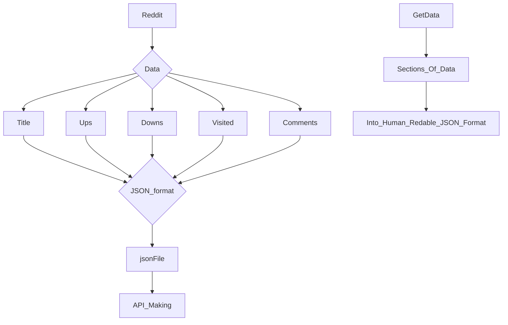

# 👉Output View
 </img>

# 👉Code Section
  ## Aim
  - Get data from Reddit, Create JSON data and Store in .json file.
  - Make a API from json file to do API testing Using Postman.
  ## Things Required
  - [Cypress](https://www.cypress.io/)
  - [VS Code](https://code.visualstudio.com/)
  - [Python](https://docs.python.org/3/)
  - [Postman](https://www.postman.com/)
  ## Procedure
  1. Make a python code which takes data from reddit.
  2. Add code convert into JSON data and save it in .json file.
  3. Make use of json file to create API.
  ## Theory
  ### CheckList
  - `Python Module`/`Commands`/`Applications` Used
      - [x] `praw`: Used to access data from reddit.
      - [x] `json`: Converting normal data into the json and then saving it in .json file.
      - [x] `json-server`: To make the json file to run as API.
      - [x] `json-server jsonFileName`: Command to make API.
      - [ ] `Postman`: Still Not used.
  ### Commands Used
  #### JSON server
  ```bash
  npm install -g json-server
  json-server JsonfileName
  ```
  #### Python Code
  ```python
  import praw
  import json
  
  search = 'india'
  post_limit = 5
  comment_limit = 5
  
  data = {
      "contents": []
  }
  
  reddit = praw.Reddit(client_id = 'G9heEJHCuVMWJTo64a-jng', 
                       client_secret = 'AO07lIvh5nSC5-vNsZFoSHxJ4kq_MQ',
                       username = 'ConsequenceShoddy488',
                       password = 'Reddit1!',
                       user_agent = 'ConsequenceShoddy488v1')
  
  subreddit = reddit.subreddit(search)
  hot_python = subreddit.top(limit=post_limit)
  ids = 0
  for submission in hot_python:
      data_ele = {}
      # print(dir(submission))
      # ['STR_FIELD', '__class__', '__delattr__', '__dict__', '__dir__', '__doc__', '__eq__', '__format__', '__ge__', '__getattr__', '__getattribute__', '__getstate__', '__gt__', '__hash__', '__init__', '__init_subclass__', '__le__', '__lt__', '__module__', '__ne__', '__new__', '__reduce__', '__reduce_ex__', '__repr__', '__setattr__', '__sizeof__', '__str__', '__subclasshook__', '__weakref__', '_additional_fetch_params', '_chunk', '_comments_by_id', '_edit_experimental', '_fetch', '_fetch_data', '_fetch_info', '_fetched', '_kind', '_reddit', '_replace_richtext_links', '_reset_attributes', '_safely_add_arguments', '_url_parts', '_vote', 'add_fetch_param', 'all_awardings', 'allow_live_comments', 'approved_at_utc', 'approved_by', 'archived', 'author', 'author_flair_background_color', 'author_flair_css_class', 'author_flair_richtext', 'author_flair_template_id', 'author_flair_text', 'author_flair_text_color', 'author_flair_type', 'author_fullname', 'author_is_blocked', 'author_patreon_flair', 'author_premium', 'award', 'awarders', 'banned_at_utc', 'banned_by', 'can_gild', 'can_mod_post', 'category', 'clear_vote', 'clicked', 'comment_limit', 'comment_sort', 'comments', 'content_categories', 'contest_mode', 'created', 'created_utc', 'crosspost', 'delete', 'disable_inbox_replies', 'discussion_type', 'distinguished', 'domain', 'downs', 'downvote', 'duplicates', 'edit', 'edited', 'enable_inbox_replies', 'flair', 'fullname', 'gild', 'gilded', 'gildings', 'hidden', 'hide', 'hide_score', 'id', 'id_from_url', 'is_created_from_ads_ui', 'is_crosspostable', 'is_meta', 'is_original_content', 'is_reddit_media_domain', 'is_robot_indexable', 'is_self', 'is_video', 'likes', 'link_flair_background_color', 'link_flair_css_class', 'link_flair_richtext', 'link_flair_template_id', 'link_flair_text', 'link_flair_text_color', 'link_flair_type', 'locked', 'mark_visited', 'media', 'media_embed', 'media_only', 'mod', 'mod_note', 'mod_reason_by', 'mod_reason_title', 'mod_reports', 'name', 'no_follow', 'num_comments', 'num_crossposts', 'num_reports', 'over_18', 'parse', 'permalink', 'pinned', 'post_hint', 'preview', 'pwls', 'quarantine', 'removal_reason', 'removed_by', 'removed_by_category', 'reply', 'report', 'report_reasons', 'save', 'saved', 'score', 'secure_media', 'secure_media_embed', 'selftext', 'selftext_html', 'send_replies', 'shortlink', 'spoiler', 'stickied', 'subreddit', 'subreddit_id', 'subreddit_name_prefixed', 'subreddit_subscribers', 'subreddit_type', 'suggested_sort', 'thumbnail', 'thumbnail_height', 'thumbnail_width', 'title', 'top_awarded_type', 'total_awards_received', 'treatment_tags', 'unhide', 'unsave', 'ups', 'upvote', 'upvote_ratio', 'url', 'url_overridden_by_dest', 'user_reports', 'view_count', 'visited', 'wls']
      if not submission.stickied:
          print("\nSubmission not stickied\nTitle: {}\nUps: {}, Down: {}.\nVisited: {}.".format(
          submission.title,
          submission.ups, 
          submission.downs, 
          submission.visited))
          data_ele["id"] = ids; ids += 1
          data_ele["Title"] = submission.title
          data_ele["Ups"] = submission.ups
          data_ele["Downs"] = submission.downs
          data_ele["Visited"] = submission.visited
          data_ele["Comments"] = []
          i = 0
          comments = []
          submission.comments.replace_more(limit = 0)
          for comment in submission.comments.list():
              if i >= comment_limit: break
              print("\nParent id: " + str(comment.parent()))
              print("Comment id: " + str(comment.id))
              try:
                  print(comment.body)
                  comments.append(comment.body)
                  data_ele["Comments"].append(comment.body)
              except Exception as e:
                  print(e)
              i += 1  
           
      else:
          print("\nSubmission stickied\nTitle: {}\nUps: {}, Down: {}.\nVisited: {}.".format(
          submission.title,
          submission.ups, 
          submission.downs, 
          submission.visited))
      data["contents"].append(data_ele)
  
  # print(data)
  
  # Step 2: Specify the filename
  filename = "data.json"
  
  # Step 3: Write the data to a JSON file
  with open(filename, 'w') as json_file:
      json.dump(data, json_file, indent=4)  # Use indent=4 for pretty formatting
  
  print(f"JSON file '{filename}' created successfully!")

  ```
#### Output
  ```bash
{
    "contents": [
        {
            "id": 0,
            "Title": "'We've only been here a few hours and have seen half a dozen people die while they wait for treatment.' - Sky News ground report from Delhi",
            "Ups": 37302,
            "Downs": 0,
            "Visited": false,
            "Comments": [
                "I would urge indian media to grow some spine. People will remember this. The family members of dead people will remember this.",
                "I like how people in the comments are like, there was no need to show those visuals, it was distasteful, comparing these reporters to vultures. \n\nOnly if the knew the state of reporting in India.",
                "A request , please whatts app these videos across all group's.Time to awaken the Privileged idiots who keep turning a Blind eye  to the grim reality .",
                "[Source - Alex Crawford, Sky News](https://twitter.com/SkyNews/status/1385568739635171328?s=19)\n\n['There's no dignity in a lot of admissions here, there's no dignity in death here'](https://twitter.com/SkyNews/status/1385569375743250435?s=19) Another video from Sky News, you can hear her voice break as she reports the situation.",
                "[deleted]"
            ]
        },
        {
            "id": 1,
            "Title": "Neeraj Chopra Creates History !! Wins India's Second Ever Individual Gold Medal in the Olympics with an amazing throw of 87.58m !! A proud moment for every Indian .",
            "Ups": 34508,
            "Downs": 0,
            "Visited": false,
            "Comments": [
                "Other discussions:\n\nhttps://olympics.com/tokyo-2020/olympic-games/en/results/athletics/result-men-s-javelin-throw-fnl-000100-.htm\n\nhttps://www.reddit.com/r/india/comments/ozs3m5/neeraj_chopra_wins_gold_in_tokyo_2020_mens/\n\n\nMedal Ceremony: \nhttps://www.reddit.com/r/india/comments/ozsogp/here_you_go_neeraj_gold_cermony/\n\n\n[Neeraj Chopras gold-winning throw! #Tokyo2020 Highlights](https://youtu.be/mo4X4Q4L3kU)",
                "Congrats from Finland\n\nI hope you celebrate him accordingly, he did something incredible for your nation.",
                "Thanks to him india has jumped whopping 20 places in medal tally",
                "[deleted]",
                "FIRST INDIAN TO WIN THE OLYMPICS GOLD IN ATHELETICS"
            ]
        },
        {
            "id": 2,
            "Title": "How to not get raped in India",
            "Ups": 33962,
            "Downs": 0,
            "Visited": false,
            "Comments": [
                "This is not OC but relevant so it stays. The OC artwork was by Ajit Ninan, one of India's finest cartoonists. This one appeared in TOI. Old timers would also remember Ninan's work in the teen magazine Target.\n\nSource image: [https://akm-img-a-in.tosshub.com/sites/cosmo/images/15/49/320x453/gallery-1449209491-enhanced-20705-1449141335-4.jpg?size=500:\\*](https://akm-img-a-in.tosshub.com/sites/cosmo/images/15/49/320x453/gallery-1449209491-enhanced-20705-1449141335-4.jpg?size=500:*)\n\nhttps://preview.redd.it/wequ471iahmc1.png?width=320&format=png&auto=webp&s=2aff12f4c49ca2a5a3b4768099eb60c6849e431e",
                "You would think at least cows are safe. But this is no country for women, or [cows](https://www.ndtv.com/india-news/man-booked-for-raping-calf-in-mp-village-3838089), or [dogs](https://www.indiatoday.in/cities/noida/story/noida-man-rapes-stray-dog-throws-from-3rd-floor-after-neighbour-sees-animal-cruelty-2454291-2023-10-27), or [goats](https://www.indiatoday.in/crime/story/pregnant-goat-rape-killed-hotel-worker-arrested-kerala-kasaragod-1931794-2022-03-31), or for that matter, a fucking [monitor lizard](https://www.indiatoday.in/india/story/bengal-monitor-lizard-raped-maharashtra-3-held-sahydari-tiger-reserve-1937027-2022-04-13)..",
                "[Man arrested for raping a Cow](https://timesofindia.indiatimes.com/city/raipur/man-arrested-for-raping-cow-in-durg/amp_articleshow/100664691.cms)\n\n\nLooks like that won't help.",
                "Sad to say this but even cows have gotten raped in our country.\nI feel pathetic while saying this but it's true",
                "You're so terribly misinformed!\n[Calf raped in UP](https://www.ndtv.com/india-news/up-man-arrested-for-raping-calf-3714722)"
            ]
        },
        {
            "id": 3,
            "Title": "It's 2021 and India is still doing brown face instead of actually hiring darker skin actors.",
            "Ups": 28771,
            "Downs": 0,
            "Visited": false,
            "Comments": [
                "And then they pat themselves on the back for taking such a 'challenging' and 'unglamourous' role...",
                "Reminds me of the time when Bhumi Pednekar took a bath in sewer and played a dark skinned woman in a movie which was supposed to be a movie about removing such stereotypes.",
                "How many darked skinned woman didn't pursue an acting career just because of their skin colour.",
                "Yall the point is the cinema industry refuses to hire actual dark skinned people and will instead just make fair skinned people darker. There was that bhumi Pednekar movie where they made her really dark, instead of getting a dark skinned person to play the role. It's almost as if they're so against dark skin that they won't even give them opportunities. Stop defending this ffs",
                "You must have all seen the movie Mary Kom, instead a hiring some one from North east they tried making PC's eye small. And as a Northeastern that's offensive."
            ]
        },
        {
            "id": 4,
            "Title": "What can India and Indians do to attract more international tourists.",
            "Ups": 27505,
            "Downs": 0,
            "Visited": false,
            "Comments": [
                "Hey r/India! Join our \"Mark My Words\" event - share your predictions for next year! &#x1F680;\n\nhttps://www.reddit.com/r/india/s/OGwbs6NLwp\n\n\n*I am a bot, and this action was performed automatically. Please [contact the moderators of this subreddit](/message/compose/?to=/r/india) if you have any questions or concerns.*",
                "India first needs to boost domestic tourism before focusing on international tourists. We need to learn how to treat our own fellow countrymen with respect and dignity. If local women in this country can\u2019t travel then we can\u2019t expect things to get better for foreigners. Indian tourist will only learn how to behave once there is a culture of traveling within India.",
                "Staring is national disease",
                "He forgot \n- spitting, voiding bladder and generally dirtying and throwing trash on the streets. \n- following some traffic rules so that everyone can reach their destinations on time.",
                "It's not just staring. My wife is English and every time I'm visiting home and have to step out of the house I'm tense. Men are constantly trying to rub up against or grope her. Anywhere we go, people will come up and ask to take pictures with her, when we say no they often get aggressive and abusive then proceed to take pictures of her without consent. I have to act like a 24/7 security detail when I'm out and about with her. \n \nThis has happened to us at India gate, war memorial, museums, while waiting for a table at restaurants, on the shatabdi express, at humayuns tomb, and these are the incidents I can think of off the top of my head.\n\nIt's embarrassing and saddens me because these experiences make my wife not want to come to India. As for a fix there isn't one. Even my parents brush these incidents off by saying, people are just excited by the novelty of seeing a white person and we should not take it to heart."
            ]
        }
    ]
}
  ```
## 👉 Flowchart

